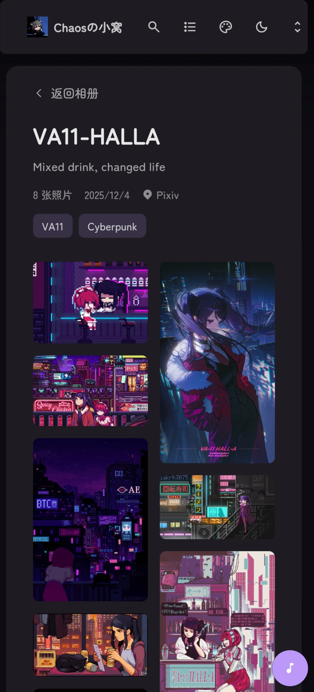
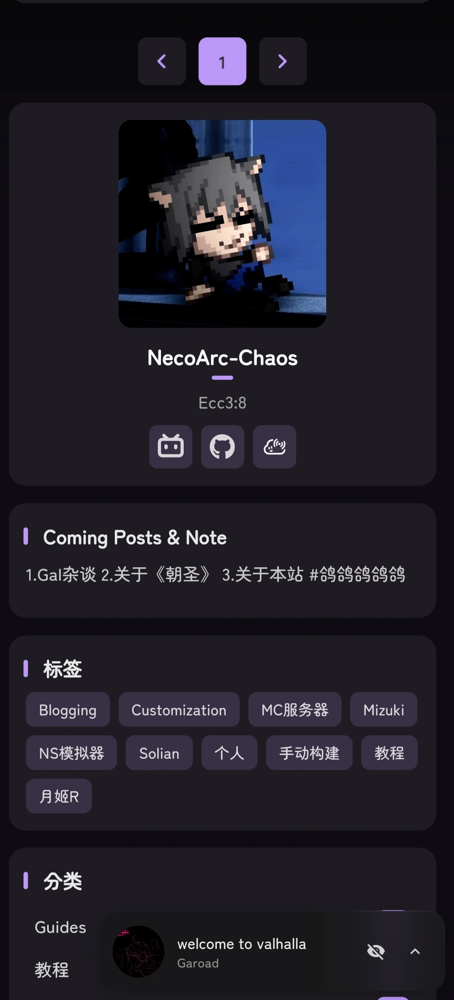
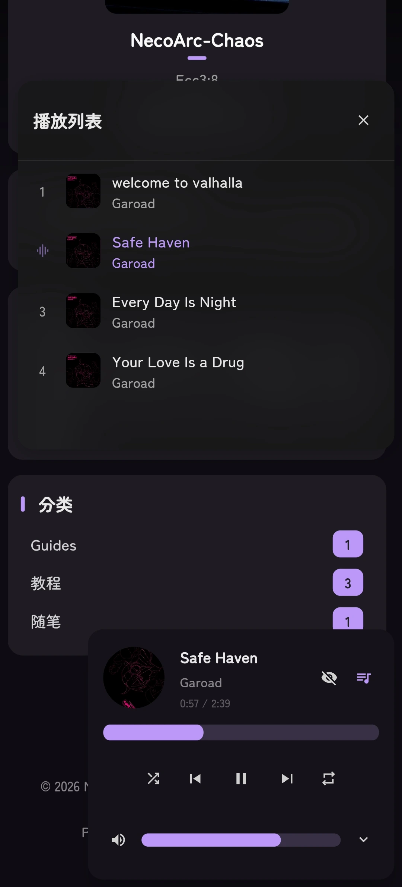

# 🌸 Mizuki


一个现代化、功能丰富的静态博客模板，基于 [Astro](https://astro.build) 构建，具有先进的功能和精美的设计。

[](https://nodejs.org/)
[](https://pnpm.io/)
[](https://astro.build/)
[](https://www.typescriptlang.org/)
[](https://opensource.org/licenses/Apache-2.0)

[**🖥️ 在线演示**](https://mizuki.mysqil.com/) | [**📝 用户文档**](https://docs.mizuki.mysqil.com/)

🌏 **README Languages:**
[**English**](./README.md) / [**中文**](./README.zh.md) / [**日本語**](./README.ja.md) / [**繁體中文**](./README.tw.md) /

通过我们的综合文档快速开始。无论是自定义主题、配置功能，还是部署到生产环境，文档涵盖了您成功启动博客所需的所有内容。

[📚 阅读完整文档](https://docs.mizuki.mysqil.com/) →


<table>
  <tr>
    <td></td>
    <td></td>
    <td></td>
  <tr>
  <tr>
    <td></td>
    <td></td>
    <td></td>
  <tr>
</table>

## 🚀 NEW: 自动分辨率适配

> **🎯 自动分辨率算法** - 智能适配内容布局基于设备屏幕分辨率，为所有设备提供最佳观看体验

🌏 README 语言
[**English**](./README.md) /
[**中文**](./README.zh.md) /
[**日本語**](./README.ja.md) /
[**繁體中文**](./README.tw.md) /

### 🔧 Component Configuration System Restructuring

- **Unified Configuration Architecture:** Brand new modular component configuration system, supporting dynamic component management and order configuration
- **Configuration-Driven Component Loading:** Restructured SideBar component, implementing fully configuration-based component loading mechanism
- **Unified Control Switches:** Removed independent enable switches for music player and announcement components, unified control through sidebarLayoutConfig
- **Responsive Layout Adaptation:** Components support responsive layouts, automatically adjusting display based on device type

### 📐 Layout System Optimization

- **Dynamic Sidebar Position Adjustment:** Support for left/right sidebar switching, with automatic layout adaptation
- **Intelligent Article Directory Positioning:** When sidebar is on the right, article navigation automatically moves to the left, providing a better reading experience
- **Grid Layout Improvements:** Optimized CSS Grid layout, resolving container width anomaly issues

### 🎛️ Configuration File Format Standardization

- **Standardized Configuration Format:** Created unified component configuration file format specifications
- **Type Safety:** Comprehensive TypeScript type definitions ensuring configuration type safety
- **Extensibility:** Support for custom component types and configuration options

### 🧹 Code Optimization

- **Test File Cleanup:** Removed unused test configurations and dependencies, reducing project size
- **Code Structure Optimization:** Improved component architecture, enhancing code maintainability
- **Performance Improvement:** Optimized component loading logic, improving page rendering performance

---

## ✨ 功能特性

### 🎨 Design & Interface

- [x] Built with [Astro](https://astro.build) and [Tailwind CSS](https://tailwindcss.com)
- [x] Smooth animations and page transitions using [Swup](https://swup.js.org/)
- [x] Light/dark theme switching with system preference detection
- [x] Customizable theme colors and dynamic banner carousel
- [x] Fullscreen background images with carousel, opacity, and blur effects
- [x] Fully responsive design for all devices
- [x] Beautiful typography with JetBrains Mono font

### 🔍 Content & Search

- [x] Advanced search functionality based on [Pagefind](https://pagefind.app/)
- [x] [Enhanced Markdown features](#-markdown-extensions) with syntax highlighting
- [x] Interactive table of contents with auto-scrolling
- [x] RSS feed generation
- [x] Reading time estimation
- [x] Article categorization and tagging system

### 📱 Special Pages

- [x] **Anime Tracking Page** - Track anime watching progress and ratings
- [x] **Friends Page** - Beautiful cards showcasing friend websites
- [x] **Diary Page** - Share life moments, similar to social media
- [x] **Archive Page** - Organized timeline view of articles
- [x] **About Page** - Customizable personal introduction

### 🛠 Technical Features

- [x] **Enhanced code blocks** based on [Expressive Code](https://expressive-code.com/)
- [x] **Math formula support** with KaTeX rendering
- [x] **Image optimization** with PhotoSwipe gallery integration
- [x] **SEO optimization** including sitemaps and meta tags
- [x] **Performance optimization** with lazy loading and caching
- [x] **Comment system** with Twikoo integration

## 🚀 快速开始

### 📦 安装

1. **Clone the repository:**

   ```bash
   git clone https://github.com/LyraVoid/Mizuki.git
   cd Mizuki
   ```

2. **Install dependencies:**

   ```bash
   # 如果没有安装 pnpm，先安装
   npm install -g pnpm

   # Install project dependencies
   pnpm install
   ```

3. **配置博客：**
   - 编辑 `src/config.ts` 自定义博客设置
   - 更新站点信息、主题色彩、横幅图片和社交链接
   - 配置特色页面功能
   - (可选) 配置内容仓库分离 - 见 [内容仓库配置](#-代码内容分离可选)

4. **启动开发服务器：**
   ```bash
   pnpm dev
   ```
   博客将在 `http://localhost:4321` 可用

### 📝 内容管理

- **创建新文章：** `pnpm new-post <文件名>`
- **编辑文章：** 修改 `src/content/posts/` 中的文件
- **自定义页面：** 编辑 `src/content/spec/` 中的特殊页面
- **添加图片：** 将图片放在 `src/assets/` 或 `public/` 中

### 🚀 部署

将博客部署到任何静态托管平台：

- **Vercel：** 连接 GitHub 仓库到 Vercel
- **Netlify：** 直接从 GitHub 部署
- **GitHub Pages：** 使用包含的 GitHub Actions 工作流
- **Cloudflare Pages：** 连接您的仓库

- **环境变量配置（可选）：** 可参照 `.env.example` 来配置

部署前，请在 `src/config.ts` 中更新 `siteURL`。
**不建议**将 `.env` 文件提交到 Git，`.env` 应该仅在本地调试或构建使用。若要将项目在云平台部署，建议通过平台上的 `环境变量` 配置传入。

## 📝 文章前言格式

```yaml
---
title: 我的第一篇博客文章
published: 2023-09-09
description: 这是我新博客的第一篇文章。
image: ./cover.jpg
tags: [标签1, 标签2]
category: 前端
draft: false
pinned: false
comment: true
lang: en # Only set when article language differs from site language in config.ts
---
```

### Frontmatter 字段说明

- **title**: 文章标题（必需）
- **published**: 发布日期（必需）
- **description**: 文章描述，用于 SEO 和预览
- **image**: 封面图片路径（相对于文章文件）
- **tags**: 标签数组，用于分类
- **category**: 文章分类
- **draft**: 设置为 `true` 在生产环境中隐藏文章
- **pinned**: 设置为 `true` 将文章置顶
- **comment**: 设置为 `true` 启用文章评论区（需全局启用评论功能）
- **lang**: 文章语言（仅当与站点默认语言不同时设置）

### 置顶文章功能

`pinned` 字段允许您将重要文章置顶到博客列表的顶部。置顶文章将始终显示在普通文章之前，无论其发布日期如何。

**Usage:**

```yaml
pinned: true  # 将此文章置顶
pinned: false # 普通文章（默认）
```

**Sorting Rules:**

1. Pinned articles appear first, sorted by publication date (newest first)
2. Regular articles follow, sorted by publication date (newest first)

### 文章级评论控制

`comment` 字段允许您单独控制每篇文章评论区的开启与关闭。

**Usage:**

```yaml
comment: true  # 启用评论（默认）
comment: false # 禁用评论
```

**注意：**
此功能需要先在 `src/config.ts` 中启用评论系统。

## 🧩 Markdown 扩展语法

Mizuki 支持超越标准 GitHub Flavored Markdown 的增强功能：

### 📝 Enhanced Writing

- **Callouts:** Create beautiful annotation boxes using `> [!NOTE]`, `> [!TIP]`, `> [!WARNING]`, etc.
- **Math Formulas:** Write LaTeX math formulas using `$inline$` and `$$block$$` syntax
- **Code Highlighting:** Advanced syntax highlighting with line numbers and copy buttons
- **GitHub Cards:** Embed repository cards using `::github{repo="user/repo"}`

### 🎨 Visual Elements

- **Image Gallery:** Automatic PhotoSwipe integration for image viewing
- **Collapsible Sections:** Create expandable content blocks
- **Custom Components:** Enhance content with special directives

### 📊 Content Organization

- **Table of Contents:** Automatically generated from headings with smooth scrolling
- **Reading Time:** Automatically calculated and displayed
- **Article Metadata:** Rich frontmatter support with categories and tags

## ⚡ 命令

所有命令都在项目根目录运行：

| Command                    | Action                                     |
| :------------------------- | :----------------------------------------- |
| `pnpm install`             | Install dependencies                       |
| `pnpm dev`                 | Start local dev server at `localhost:4321` |
| `pnpm build`               | Build production site to `./dist/`         |
| `pnpm preview`             | Preview build locally before deployment    |
| `pnpm check`               | Run Astro error checking                   |
| `pnpm format`              | Format code with Prettier                  |
| `pnpm lint`                | Check and fix code issues                  |
| `pnpm new-post <filename>` | Create a new blog post                     |
| `pnpm astro ...`           | Run Astro CLI commands                     |

## 🎯 配置指南

### 🔧 基础配置

编辑 `src/config.ts` 自定义您的博客：

```typescript
export const siteConfig: SiteConfig = {
  title: "您的博客名称",
  subtitle: "您的博客描述",
  lang: "zh-CN", // 或 "en"、"ja" 等
  themeColor: {
    hue: 210, // 0-360，主题色调
    fixed: false, // 隐藏主题色选择器
  },
  banner: {
    enable: true,
    src: ["assets/banner/1.webp"], // 横幅图片
    carousel: {
      enable: true,
      interval: 0.8, // 秒
    },
  },
};
```

### 📱 特色页面配置

- **追番页面：** 在 `src/pages/anime.astro` 中编辑动画列表
- **友链页面：** 在 `src/content/spec/friends.md` 中编辑朋友数据
- **日记页面：** 在 `src/pages/diary.astro` 中编辑动态
- **关于页面：** 在 `src/content/spec/about.md` 中编辑内容

### 📦 代码内容分离 (可选)

Mizuki 支持将代码和内容分成两个独立的仓库管理,适合团队协作和大型项目。

**快速选择**:

| Use Case                    | Configuration                  | For Whom                            |
| --------------------------- | ------------------------------ | ----------------------------------- |
| 🆕 **Local Mode** (default) | No configuration, use directly | Beginners, personal blogs           |
| 🔧 **Separation Mode**      | Set `ENABLE_CONTENT_SYNC=true` | Team collaboration, private content |

**一键启用/禁用**:

```bash
# 方式 1: 本地模式 (推荐新手)
# 不创建 .env 文件,直接运行
pnpm dev

# 方式 2: 内容分离模式
# 1. 复制配置文件
cp .env.example .env

# 2. 编辑 .env,启用内容分离
ENABLE_CONTENT_SYNC=true
CONTENT_REPO_URL=https://github.com/your-username/Mizuki-Content.git

# 3. 同步内容
pnpm run sync-content
```

**Features**:

- ✅ Supports public and private repositories 🔐
- ✅ One-click enable/disable without code modification
- ✅ Auto-sync, pulls latest content automatically before development

📖 **详细配置**: [内容分离完整指南](docs/CONTENT_SEPARATION.md)  
🔄 **迁移教程**: [从单仓库迁移到分离模式](docs/MIGRATION_GUIDE.md)  
📚 **更多文档**: [文档索引](docs/README.md)

## ✏️ 贡献

我们欢迎贡献！请随时提交问题和拉取请求。

1. Fork 仓库
2. 创建功能分支 (`git checkout -b feature/amazing-feature`)
3. 提交更改 (`git commit -m 'Add some amazing feature'`)
4. 推送到分支 (`git push origin feature/amazing-feature`)
5. 打开拉取请求

## 📄 许可证

本项目基于 Apache 许可证 2.0 - 查看 [LICENSE](LICENSE) 文件了解详情。

### 原始项目许可证

本项目基于 [Fuwari](https://github.com/saicaca/fuwari) 开发，该项目使用 MIT 许可证。根据 MIT 许可证要求，原始版权声明和许可声明已包含在 LICENSE.MIT 文件中。

## 🙏 致谢

- 基于原始 [Fuwari](https://github.com/saicaca/fuwari) 模板
- 灵感来源于 [Yukina](https://github.com/WhitePaper233/yukina) - 一个美丽优雅的博客模板
- 部分设计灵感来源于 [Firefly](https://github.com/CuteLeaf/Firefly) 和 [Twilight](https://github.com/spr-aachen/Twilight) 模板
- 使用 [Pio](https://github.com/Dreamer-Paul/Pio) 实现可爱的 Live2D 看板娘插件
- 使用 [Astro](https://astro.build) 和 [Tailwind CSS](https://tailwindcss.com) 构建
- 图标来自 [Iconify](https://iconify.design/)

### 🌸 特别感谢

- **[Fuwari](https://github.com/saicaca/fuwari)** by saicaca - 本项目所基于的原始模板。感谢您创建了如此漂亮且功能强大的模板。
- **[Yukina](https://github.com/WhitePaper233/yukina)** - 感谢提供设计灵感和创意，帮助塑造了这个项目。Yukina 是一个优雅的博客模板，展现了出色的设计原则和用户体验。
- **[Firefly](https://github.com/CuteLeaf/Firefly)** - 感谢提供优秀的布局设计思路，双侧边栏布局、文章双列网格等布局，及部分小组件的设计与实现，让 Mizuki 的界面更加丰富。
- **[Twilight](https://github.com/spr-aachen/Twilight)** - 感谢提供灵感和技术支持。Twilight 的动态壁纸模式切换系统、响应式设计和过渡效果显著提升了 Mizuki 的使用体验。

## 🍀 贡献者

## 🍀 Contributors

Thanks to all contributors for their contributions to this project. If you have any questions or suggestions, please submit an [Issue](https://github.com/LyraVoid/Mizuki/issues) or [Pull Request](https://github.com/LyraVoid/Mizuki/pulls).

<a href="https://github.com/LyraVoid/Mizuki/graphs/contributors">
  
</a>

## ⭐ Star History

## [](https://star-history.com/#LyraVoid/Mizuki&Date)

⭐ 如果您觉得这个项目有帮助，请考虑给它一个星标!
