第一次玩表（）

之前戴过一段时间的AW9，所以我会相比较来讲

## 整体体验

### 外观

圆屏，我这块是45mm版本的，大小上看着合适不小  
屏占比依然存在黑边，但相比上代已经是可以接受的程度了  
如果是使用谷歌较新的套件标准构建的软件都会有意识的针对黑边优化  
也就是说只有一些特殊软件会让黑边显得很丑

厚度是真的蛮厚的，戴过AW9再戴PW会觉得很硌，当然习惯就好（）  
黑色橡胶表带，不知道为什么我带会起皮（）  
拆卸设计大概比AW会更快捷一点

### 软件

> 友情提示：只支持安装armeabi-v7a架构（即32位）的软件  
> 基本服务均需要魔法环境

也是分点来讲

#### 健康 Health

> Fitbit 是好文明  
> 虽然但是这篇文章写着写着就改名了  
> 现在叫 Google Health

- 一些特征：
  1. 表盘 实时显示心率
:::grid{columns="2" aspect="2/3" fit="cover"}
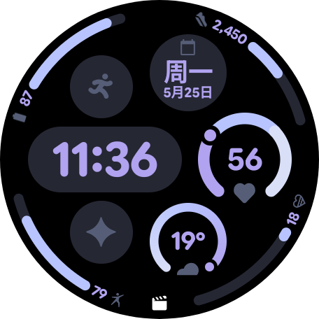

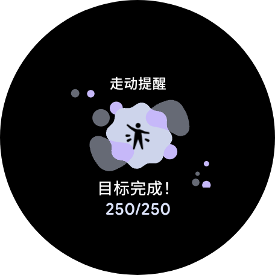

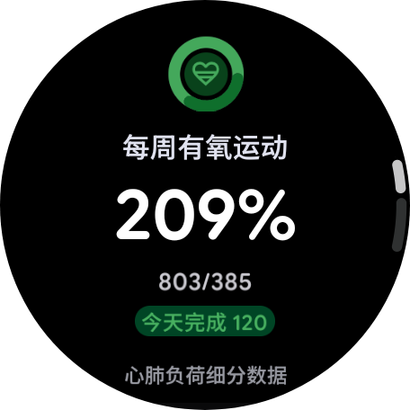

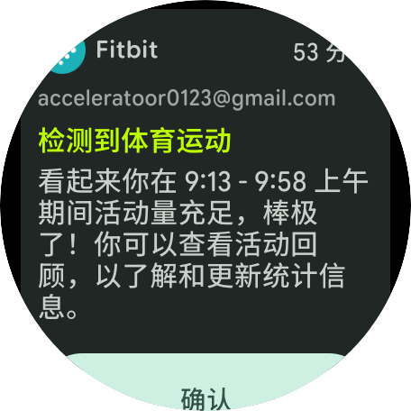
:::
  3. 会根据你的各样情况并给出你每天的"准备状态"
  4. 一个重要指标叫"心肺负荷"，即运动量，可以自己设置大致目标，然后它会根据你的"准备状态"给你设置一天的目标范围（新版本现在设置的是一整周的）  
  6. 跑步会给出很多详细信息（但是我不会看，什么触地时间）
  7. 身体反应：会在检测到你有情绪（无论开心还是伤感）时提示你，然后可以选择记录心情。这个有时候准有时候不准，总之还是很有意思的

:::grid{columns="2" aspect="2/3" fit="cover"}
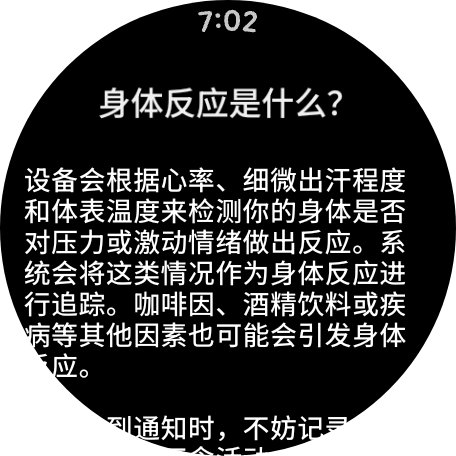

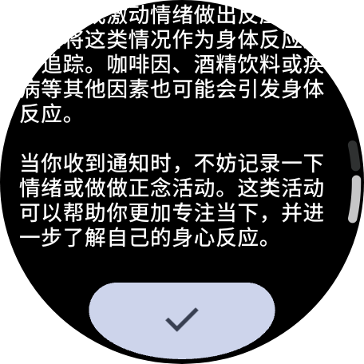

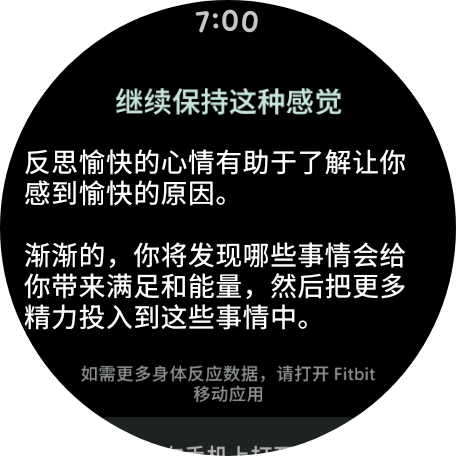

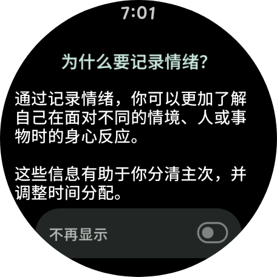
:::

以上是手表可以查看的，手机上还有更多详细的信息，什么压力分数  
而且都是免费的，不需要fitbit premium（你自己看看有多贵）

- 缺点：
  1. 睡眠信息，准备状态等必须要联网才能给出数据
  2. 运动记录也是，离线可以记录，但不联网之前是不显示的
  3. 跑步的GPS定位会偏移 （不支持北斗w）
  4. 睡眠数据等在手表上只能查看当天的数据，没有折线图
  5. 心电图要在手机软件里开启，但是心电图会有忽上忽下的异常，不知道为啥

- 一些预览
  - 老晨间早报

:::grid{columns="3" aspect="16/9" fit="cover"}
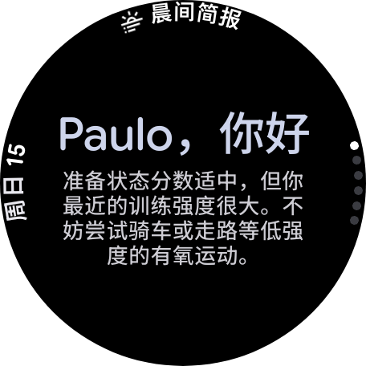

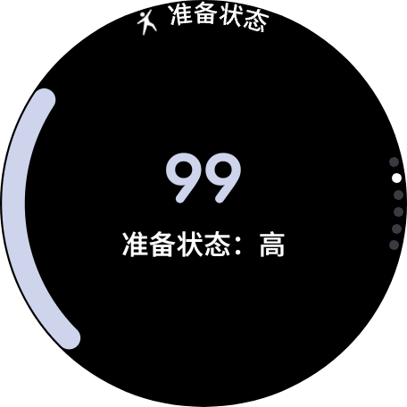

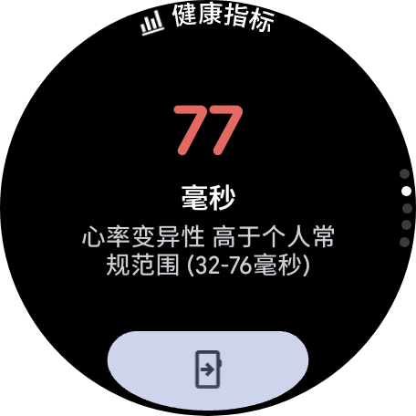

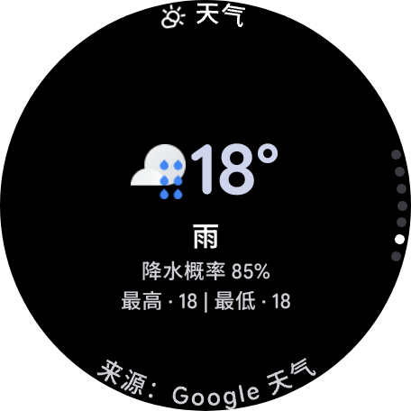
:::

  - 新晨间早报
:::grid{columns="1" aspect="16/9" fit="cover"}
 (1).png>)
:::  
  - 睡眠

:::grid{columns="2" aspect="16/9" fit="cover"}
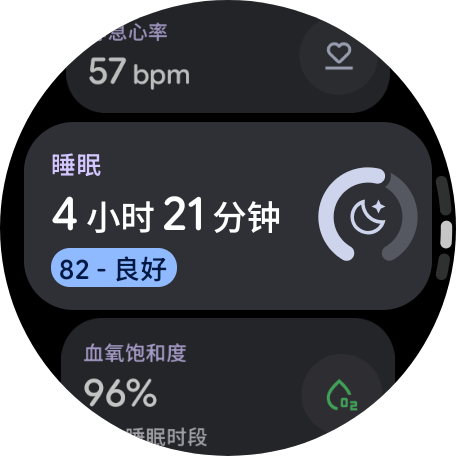

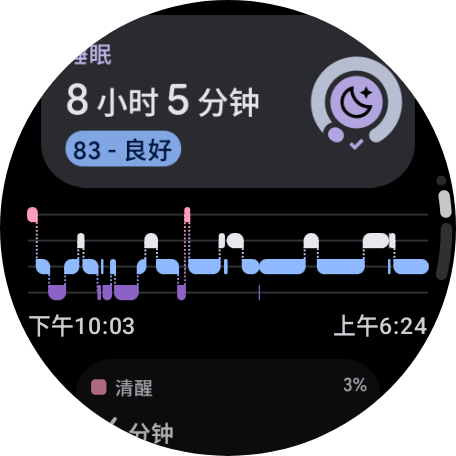
:::

#### 谷歌工具

- **Google Map**  
  最强手表导航，可惜位置偏移，大概三五百米，所以用不了
- **Gmail**  
  这个是真不错，MD3的圆屏适配看着很舒服

:::grid{columns="2" aspect="16/9" fit="cover"}
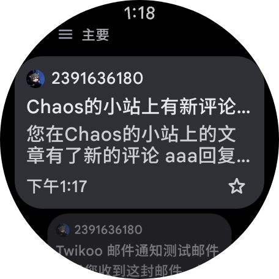

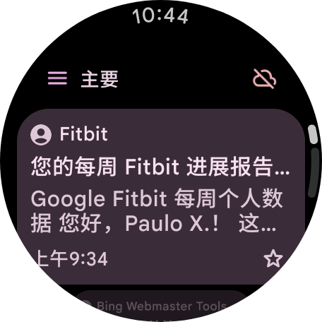
:::

- **Keep记事**  
  也很不错，清单项也是非常实用，搭配[功能块](#功能块)有奇效 \
  缺点是手表无法查看已归档/已删除的文章
:::grid{columns="1" aspect="16/9" fit="cover"}
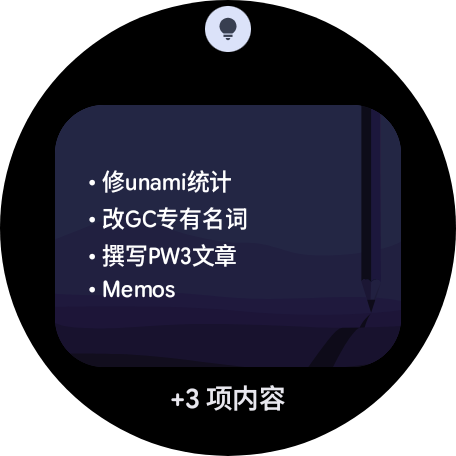
:::  
- **闹钟/计时/倒数**  
  基本工具，这都没啥特殊的，新版本支持双指手势
- **信息**  
  这个绝对是最舒服的，MD3绝杀了  
  好像还有什么AI智能回复，但我没用过
- **录音机**  
  手表就一个小麦克，音质就没啥指望了  
  同步到手机上后不错，MD3设计很舒服  
  转文字功能也很强，可惜Pixel垄断，其他任何手机都安装不了这个应用  
  （真的没有大佬尝试搞一下嘛）
- **媒体控件**  
  这个真是神，MD3E的设计真的会惊艳到  
  不过要小心，表冠不小心一转大了耳朵就爆了

:::grid{columns="3" aspect="16/9" fit="cover"}
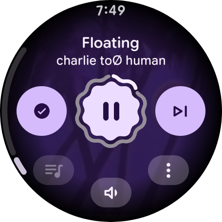

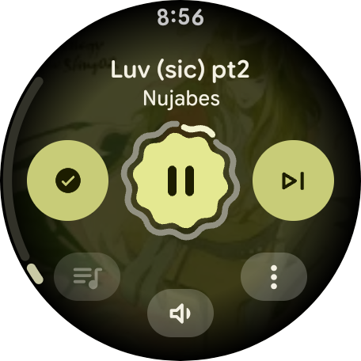

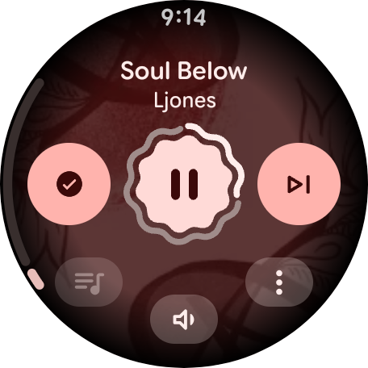

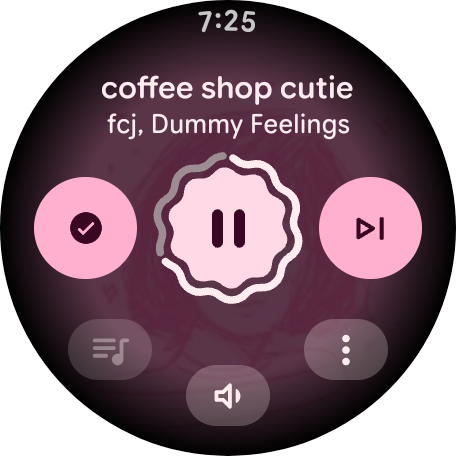

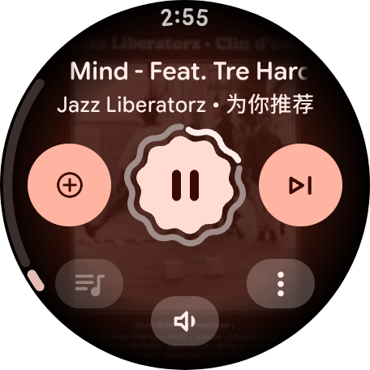

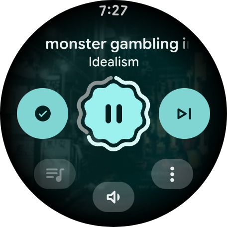
:::

- **Gemini**  
  让它定个日程啥的都没问题  
  LateX支持但不全，而且还存在文本溢出的问题  
  目前也不支持查看历史记录  
  希望后面能更新吧

:::grid{columns="3" aspect="16/9" fit="cover"}
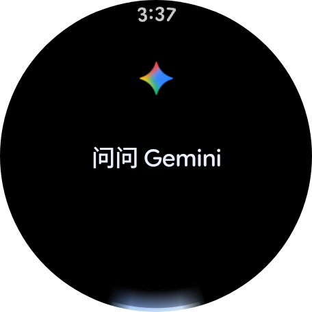

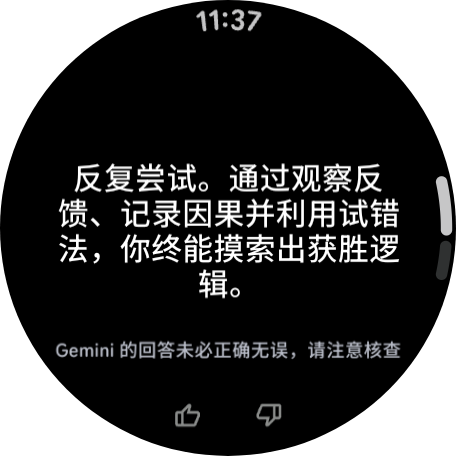

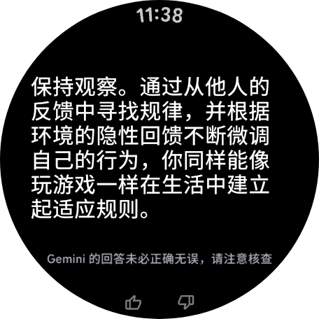
:::

- **个人安全**  
  功能包含紧急求助和安全确认  
  都用不了，只可以设置你的个人信息
- **天气**
  Google源，肯定没国内更准，但数据还是能信的  
  空气质量没有数据  
  第二三张是功能块

:::grid{columns="3" aspect="16/9" fit="cover"}
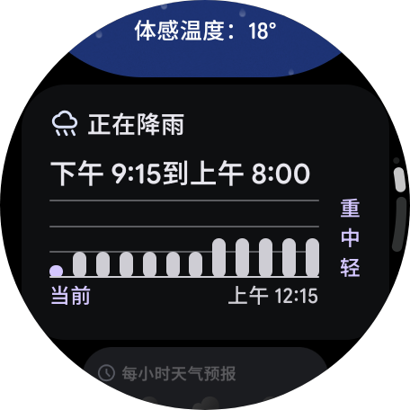

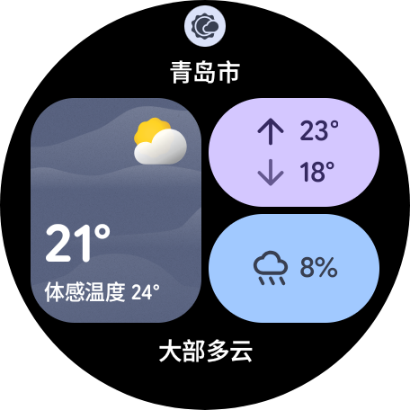
:::

#### 第三方手表软件

> 国内软件基本别想了 微信QQ支付宝都不能正常使用  
> 斜体的要从第三方渠道下载

- **Spotify**  
  懂得都懂，好用。有Premium才能选择歌曲播放/下载  
  没有Premium只能播放歌单，只能选随机播放，可以下载播客

:::grid{columns="3" aspect="16/9" fit="cover"}
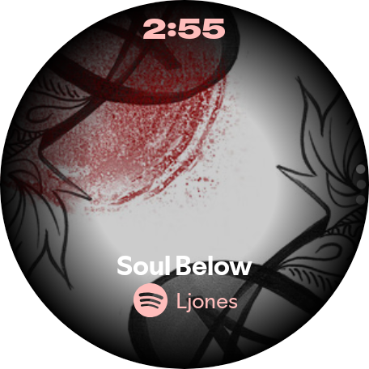

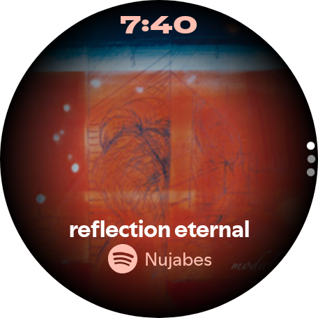

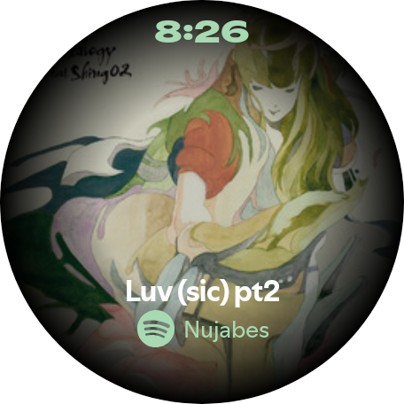

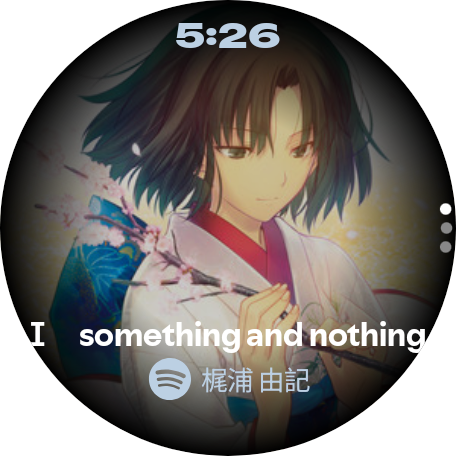

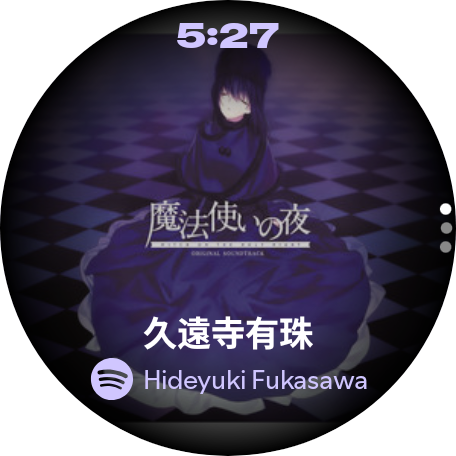

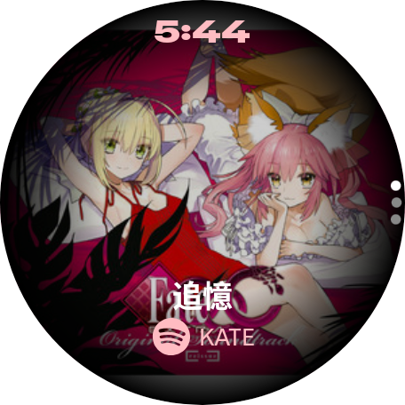

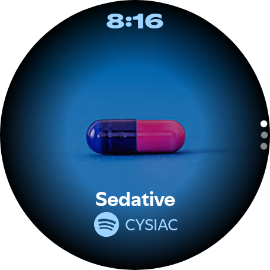

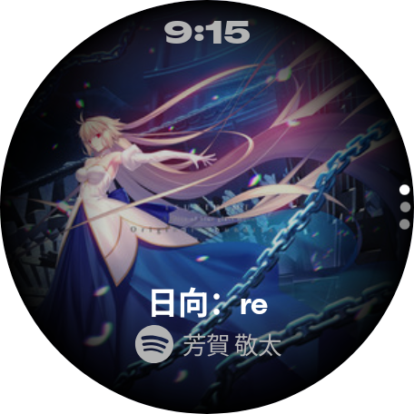

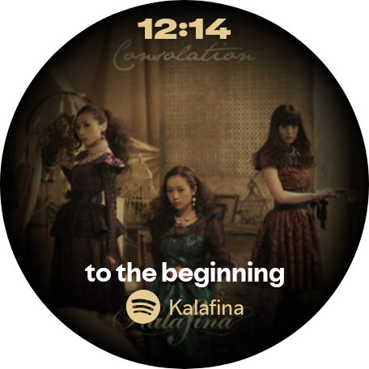

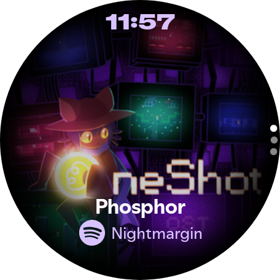

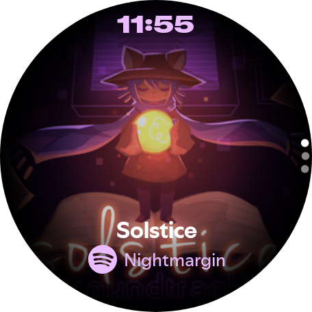

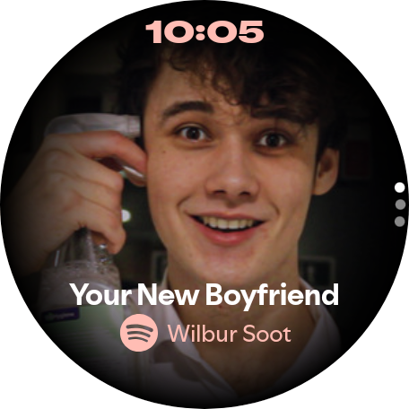

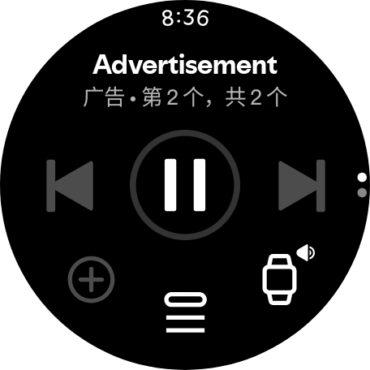

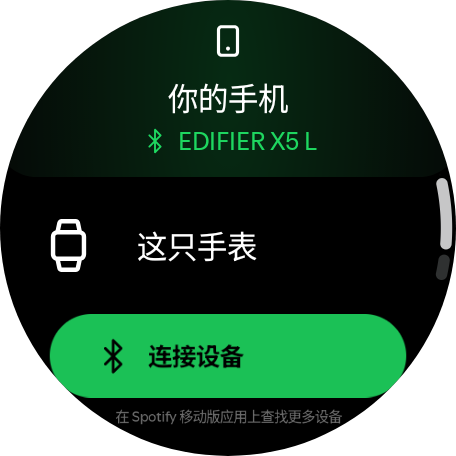
:::

- **_WearMouse_**  
  可以让你的手表化身蓝牙鼠标  
  指针会随手腕的移动而移动，非常酷
- **FingerGun-MotionGame**  
  对标AW上的空气篮球，需要一刀乐解锁完整版  
  也就是跟同学互动一下（）
- **_WearRippleLite_**  
  非常炫酷的本地音乐播放器，由琴弦上的小医生开发
- **_WearAuthn_**  
  可以通过蓝牙和NFC把手表作为FIDO2安全密钥  
  直接让你的手表升值1000块甚至300块（）
- **_Stratum_**  
  免费且开源的双因素认证应用，搭配[功能块](#功能块)看时序验证码特别方便
- **_IT之家_**
  适配圆屏
:::grid{columns="1" aspect="16/9" fit="cover"}

:::  

### 功能块

这一个非常实用的设计  
在表盘左右滑动就可以看到各种应用的功能块  
像Keep记事的清单项我就把它安排在了左滑第一个，查看清单非常方便  
然后我把Github的2FA也放在里面，右滑三下就可以看到离线也可使用的六位数验证码  
总之这个设计很天才，非常实用

### 表盘

自带的真不多，个人最喜欢这个“活力四射”，依然是MD3E  
表盘的颜色关系着系统的莫奈取色  
感觉重要的是选一个跟表带和谐一点的表盘
（etc.粉色表盘搭配粉色表带）
可以随意下载安装表盘

:::grid{columns="3" aspect="16/9" fit="cover"}

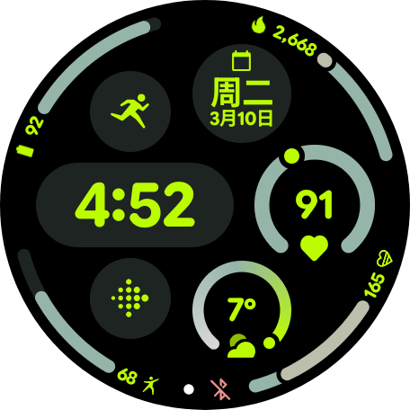

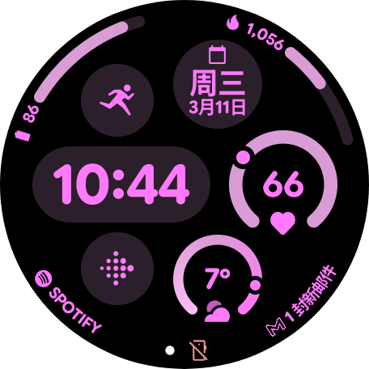
:::

