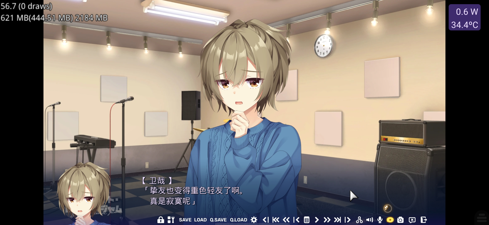

密码是我的英文名，改名了记得加o  

我非常非常非常想说点什么  
目的是你告诉你我又不一样了  

>This passage is private but public  
>如果你看不懂，就别看了，更不要瞎猜  
>我这么写不完全代表我这么想cause表达能力大差  

我大概不该在这种时间段去思考  
也不该成为这幅模样  

但意识到事实时，我似乎就这样才normal  

我偏自于认为，我不“喜欢”  
我是个有自知之明的人  
我不配追求，我从来都是这样想的  
但我“重视”  
我单方面地认为，是挚友  
我无条件地完全地信任  
并且因着曾经对我的简单关心  
我也盼望着能有所回报  
虽然从来没找过我罢了  

哦，送书的还一个原因，就是因为期望我能有所回报吧  

of my pain point  
我为我失去而伤心  
这种程度对我来说  
我一定要找那位聊才算聊  
而正巧，所以，矛盾螺旋  

我不后悔我的目的  
只是过程太随心了  
很多时候，我都抱有“我凭诚意定能”  
所以，我明白了过程需要理性  
最好的理性方式大概就是  
寻求理性的人的帮助吧  

我搞砸过很多关系，我诚实地说  
除了没边界感，自私是我一直都没意识到的  
~~我只应该多思考该怎样主动询问  
或者看出些什么主动行动  
可惜，我的能力不高~~  

~~就算真正勇敢起来，我能做好这一切吗？  
好吧，万事开头难 去发现机会？~~  
但我并不怎么被需要  
只有我在说: "我需要"  

没有反向的过程，是我的错吗？  
甚至一开始的选择？  
这算什么。  

我究竟在做什么，  

送书没错  
但我不该在没说清楚意图的前提下  
提出一些自私的要求  

大概就是这样吧  

关于那位如今我已不愿提起名字的  
我也只能有勇气与上文那位诉说  

在这里，只能说…我感到耻辱和抱歉  
我明白那是  
多的令人讨厌  
多么愚蠢和可笑  
请别，别再…我已明白  

另外我很反感什么  
“这就是成长啊，恭喜你成长了”  
我明白你很认真，我的确学习到了很多  
但是，这句话未免显得太轻巧了  
特别是在对话中，逗我呢  
你自己听听来  

我并不为此高兴到需要被恭喜的地步  

  

我的负面情绪不该这么一直延续  
我讨厌身为INFP的自己  
~~只有跟对的人在对的时间，表达清楚一切~~  
让《朝圣》再一次拯救我吧  

新的不去，旧的不来

26.1.31  
从未感受到如此孤独  
有时会觉得，自己的献出没有任何价值  
作为朋友的满怀心意的点子，也不被看见  
就这样，感觉不仅什么也没留下  
还失去了很多很多  
孤独是怎样化身武器的啊  
保罗  
我该如何…  

我无法选择逃避现实  
因为我已经选择了面对  
可是，已经没有希望了啊  
我却止不住的思考  
我需要什么来弥补我的空虚呢  
而我真的空虚吗  
为啥会有这样的感觉啊  

太荒谬了  
这…明明完全算不上什么的  
